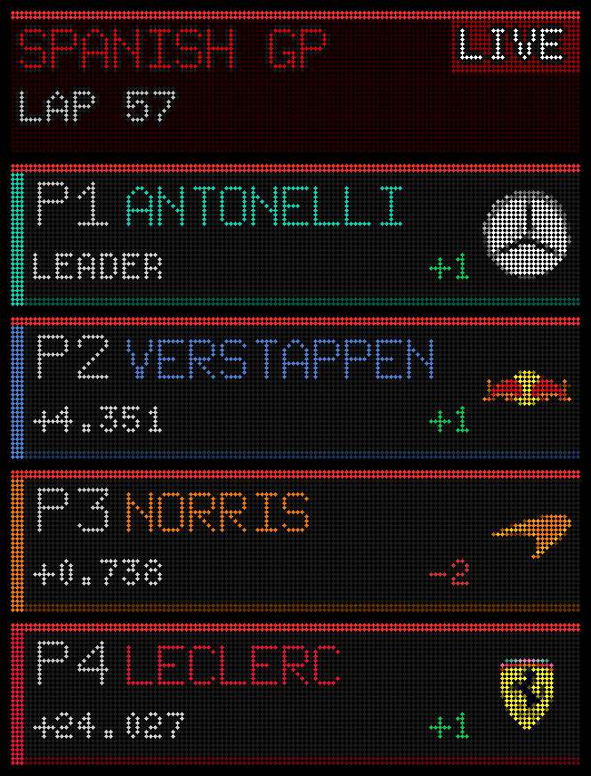
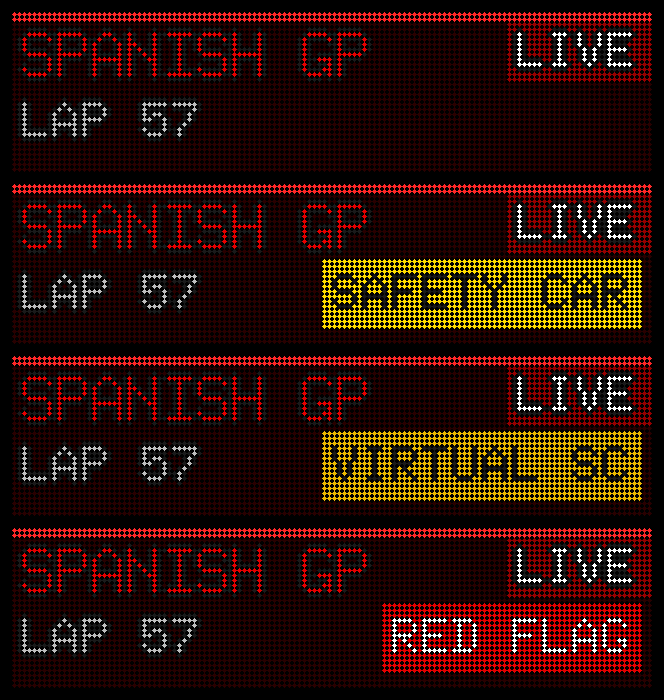
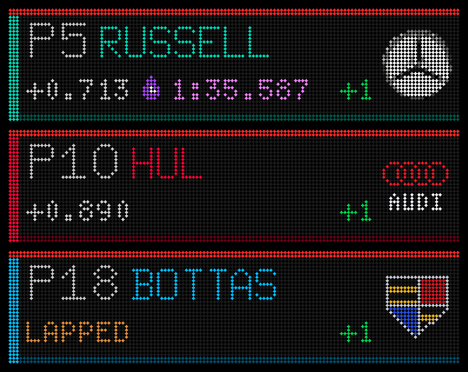
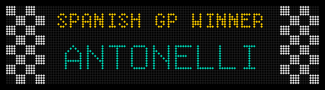
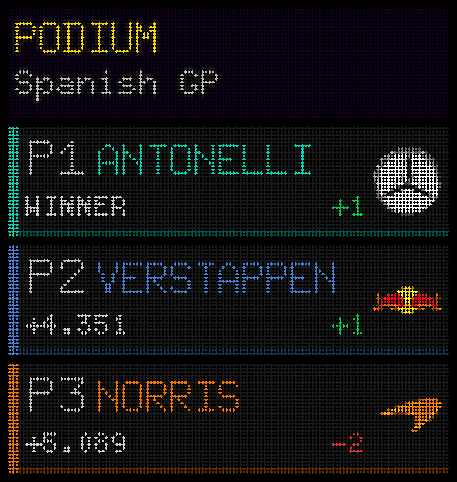
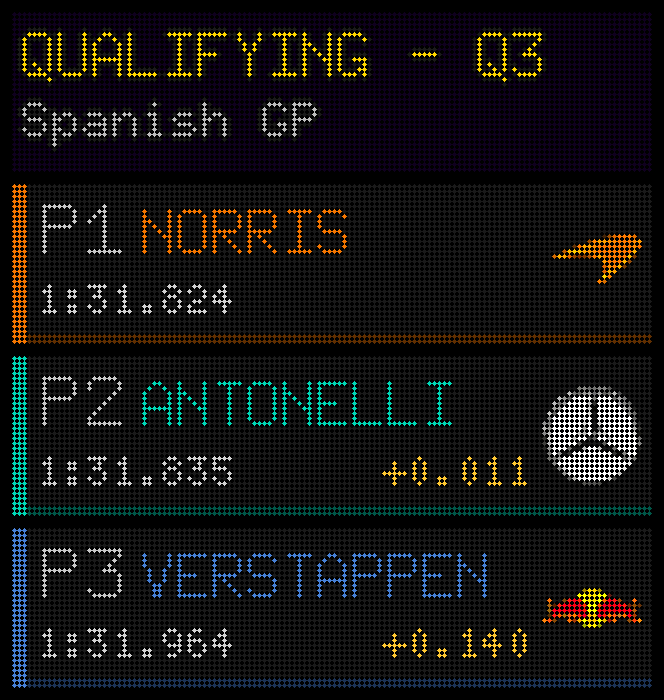

# F1 Live

**Version 1.2.0** (2026-09-13) · by [BigC07](https://github.com/BigC07)

A Formula 1 plugin for [LEDMatrix](https://github.com/ChuckBuilds/LEDMatrix) with **live timing
from F1's own feed**: the running order during races, qualifying and practice, flags as they
happen, and the winner and the podium when the chequered flag falls.

It is a fork of ChuckBuilds' [F1 Scoreboard](https://github.com/ChuckBuilds/ledmatrix-plugins)
1.8.6 (GPL-3.0). Everything upstream draws still works -- standings, results, qualifying, practice,
sprint, the calendar and the upcoming-race card -- and is described in
[README-upstream.md](README-upstream.md). This file covers what the fork adds. Its plugin id is
`f1-live`, so the plugin store's updates to `f1-scoreboard` never overwrite it.

## On the panel

Drawn with the plugin's own code from the 2026 Spanish Grand Prix, one dot per LED. Each card is
128 × 32 LEDs, and the scroll carries them across the panels one after another.

**The live board.** The header with the lap and a LIVE chip, then a card per driver: the interval
to the car ahead, places gained since the start, and a red rail along the top of every live card.



**Flags** recolour the live header: as normal, the safety car, the virtual safety car, and a red
flag.



**The fastest lap** gets a purple stopwatch and its time. Audi's rings and Cadillac's crest are
drawn for the panel, and a lapped car says so.



**When the chequered flag falls,** the winner card goes out, four times about a minute apart,



**then the podium** leads the F1 block until the official result is published.



**Qualifying's result** stays on the ticker until the race starts.



## What it adds

- **A live board.** While a session runs, its order leads the F1 block of the scroll: position,
  surname in the team's colour, and in a race the interval to the car ahead, as on TV (or the gap
  to the leader). Lapped and retired cars are labelled, places gained are shown, and a red rail
  along the top marks every live card. Practice and qualifying show the time to beat and each
  driver's gap to it.
- **Flags.** A RED FLAG badge, SAFETY CAR in yellow and VIRTUAL SC in orange on the live header.
- **Fastest lap.** A purple stopwatch and the lap time on the holder's row.
- **Results between sessions.** A finished practice or qualifying stays at the front, drawn like
  the Q3 cards, until the next session goes live. Qualifying goes when its race starts.
- **After the race.** A chequered WINNER card with the winner's name, four times about a minute
  apart, then a PODIUM header and the top three until the official result is published.
- **Small-panel readability.** Race rows with the full surname, bigger times (5x8), cleaner team
  logos, and drawn logos for Cadillac and for Audi (red rings) in place of the Sauber K.

Two things need small changes to the LEDMatrix core that are not part of this plugin: cards that
jump into the scroll just ahead of the screen (the flag and winner cards, offered through
`get_vegas_alert()`), and cards already in the scroll being repainted as the order changes.
Without them the plugin still works: flags show on the live header only, the winner card is not
shown (the podium is), and the live board is as old as the scroll's prefetch.

## Where the data comes from

- **F1 live timing** (`livetiming.formula1.com`), the feed behind F1's own live timing, also used
  by FastF1. No key, but unofficial and undocumented, so it can change without notice. The
  plugin connects only while a session it shows is streaming.
- **Jolpica** (the Ergast successor) and **ESPN** for standings, results, qualifying and the
  schedule, as upstream.
- **OpenF1**, only to replay a past session for testing: it turns anonymous clients away while a
  session is live.

## Install

Install it from its URL, `https://github.com/BigC07/ledmatrix-f1-live`, in the LEDMatrix web UI's
plugin manager, or from the Pi:

```bash
curl -X POST http://localhost:5000/api/v3/plugins/install-from-url \
  -H "Content-Type: application/json" \
  -d '{"repo_url": "https://github.com/BigC07/ledmatrix-f1-live"}'
```

Then enable **F1 Live**, and disable **F1 Scoreboard** if it is installed: the two draw the same
sections. The settings are in the web UI; [example_config.json](example_config.json) shows the
main ones as they sit in `config.json`. The plugin's Update button pulls the latest version from
this repository. It needs `requests`, `Pillow` and `pytz` (`requirements.txt`), which a LEDMatrix
install already has.

## Settings the fork adds

| Setting | Default | What |
|---|---|---|
| `live.source` | `"f1"` | `"f1"`: F1's own feed. `"openf1"`: the OpenF1 API, which needs a paid key during a live session |
| `live.session_types` | `["Race"]` | Which live sessions get a live board: `"Race"` (the Grand Prix and the sprint), `"Qualifying"`, `"Practice"` |
| `live.result_sessions` | `["Practice", "Qualifying"]` | Finished sessions kept on the ticker until the next one goes live; `[]` turns it off |
| `live.race_gap` | `"interval"` | Race rows after P1: `"interval"` to the car ahead, or `"leader"` |
| `live.cars` | `10` | How many cars the live board shows, from the front: `22` is the whole 2026 field. The favourite driver is added when outside them |
| `live.poll_interval` | `20` | Seconds between live snapshots |
| `live.replay_session_key`, `live.replay_at`, `live.fixture_dir` | `null` | Replay a finished OpenF1 session, to test the live cards without a Grand Prix |
| `vegas.sections` | `["upcoming", "last_race"]` | Which sections join the Vegas scroll, in this order. A live session, a kept result and a podium lead them by themselves |

## Tests

The tests import the LEDMatrix core, so run them on a LEDMatrix install, from its directory:

```bash
cd ~/LEDMatrix && python3 plugin-repos/f1-live/test_signalr_feed.py
```

Most expect LEDMatrix at `/home/admin/LEDMatrix` and the plugin in its `plugin-repos/f1-live`;
several take `F1_LIVE_PLUGIN` for a copy elsewhere. `fixtures/` holds messages recorded from F1's
feed (2026 Spanish GP practice), so the feed's tests run offline. `test_manifest.py` checks the
manifest and the example config the way the plugin store's review does, and needs neither.

To see an alert card without a race (with the core change described above), create a file named
`alert-test` in the plugin's folder. It is picked up within about 20 seconds and removed. Empty,
it gives the red flag; `SC`, `VSC` or `WINNER` in it gives the safety car, the virtual safety car
or the winner card:

```bash
printf WINNER > ~/LEDMatrix/plugin-repos/f1-live/alert-test
```

## Versions

**1.2.0** (2026-09-13): ready for the plugin store's review. The display modes are
`f1_live_*`, so they no longer collide with F1 Scoreboard's when both are installed; an
`example_config.json`; the alert test file sits in the plugin's own folder; installing from the
repository's URL; and `live.cars`, how many cars the live board shows, up to the whole field.

**1.1.0** (2026-09-13): the first release under its own name and repository. It carries
everything the fork has added to F1 Scoreboard 1.8.6 since 2026-09-07, as listed above: live
timing from F1's own feed, the flags, the fastest lap, results between sessions, the winner card
and the podium, and the readability work.

## Credits and licence

Based on [F1 Scoreboard](https://github.com/ChuckBuilds/ledmatrix-plugins) by ChuckBuilds, for
[LEDMatrix](https://github.com/ChuckBuilds/LEDMatrix), and licensed like it under the GNU General
Public License v3 ([LICENSE](LICENSE)). Most of the fork's changes carry an `f1-live:` comment in
the code.

Not affiliated with Formula 1. F1, FORMULA 1 and the team names and logos are trademarks of their
owners.
